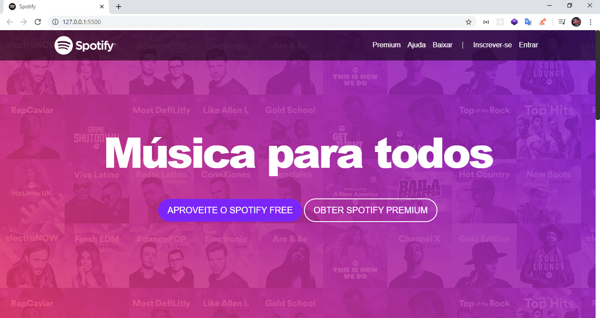
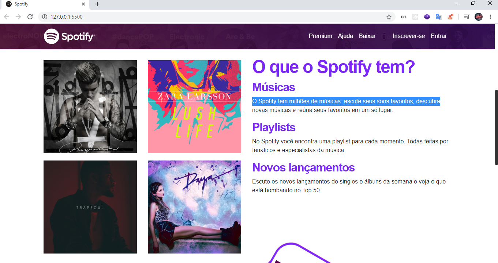

<h1 align="center">
	Spotify Clone
</h1>

Música para todos

  

  

  

    

    
    

## 🚀 Projeto

Site desenvolvido com BootStrap 4, HTML e CSS por motivos didáticos.

## 🔧 Tecnologias

- BootStrap 4
- FontAwesome 4
- HTML
- CSS
- EditorConfig;
- VSCode

## 💻 Executando a aplicação

Após clonar o repositório, acesse a pasta do projeto;

E abra o arquivo index.html no seu navegador ;)

## 🚀 **Em Constante Evolução...**

---

Feito com ♥ by [Igor Thierry](https://www.linkedin.com/in/igor-thierry-bastos-de-pina-204a27a6/)

